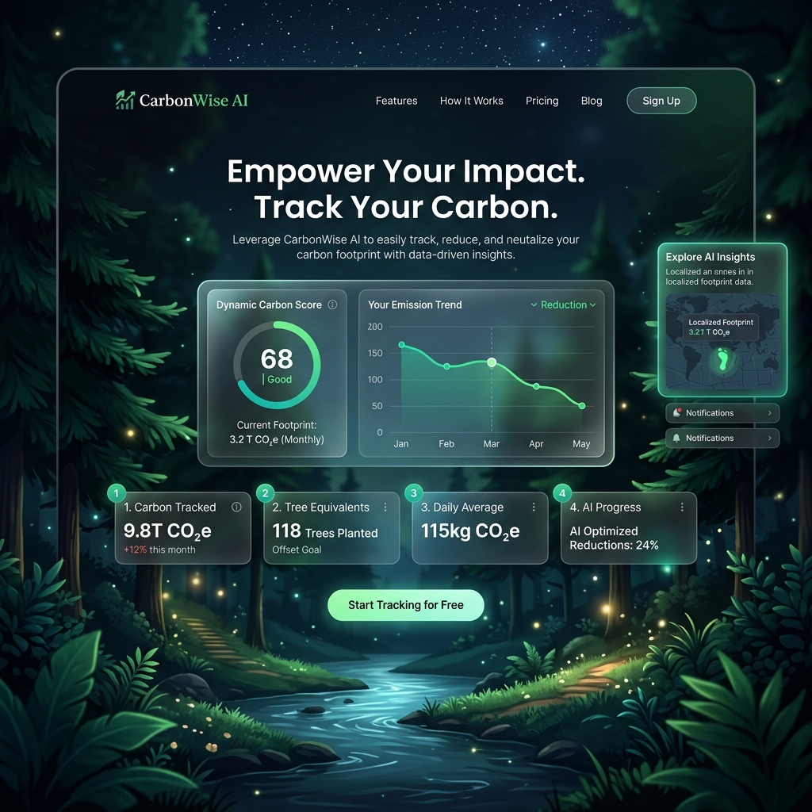
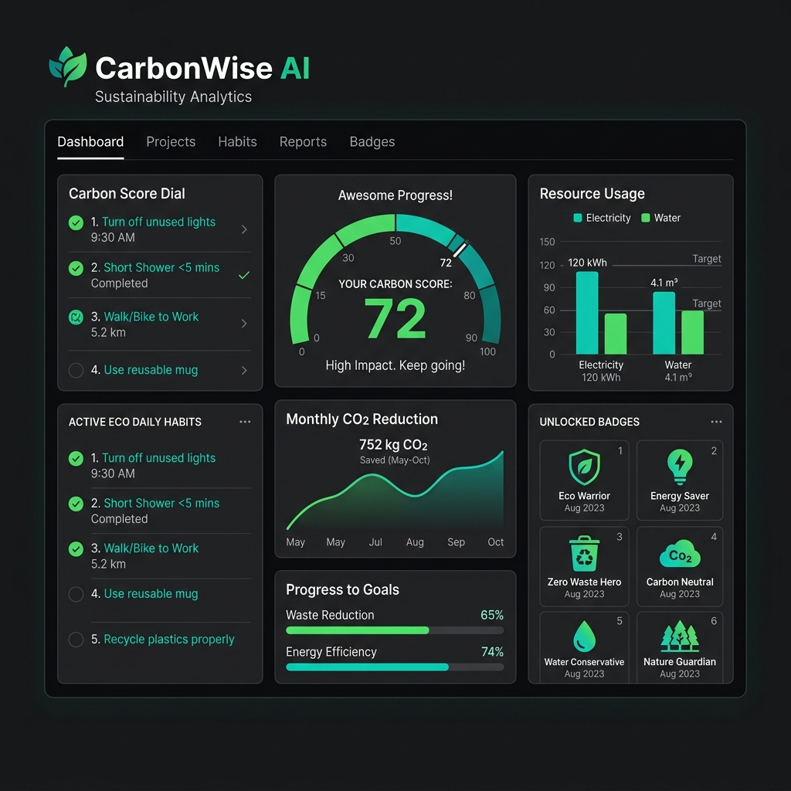
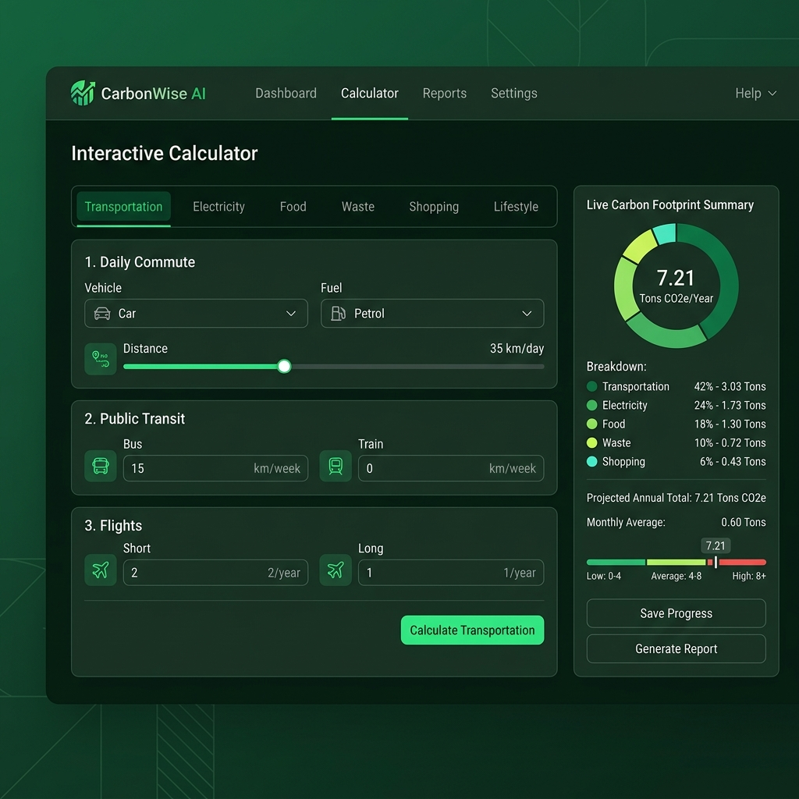
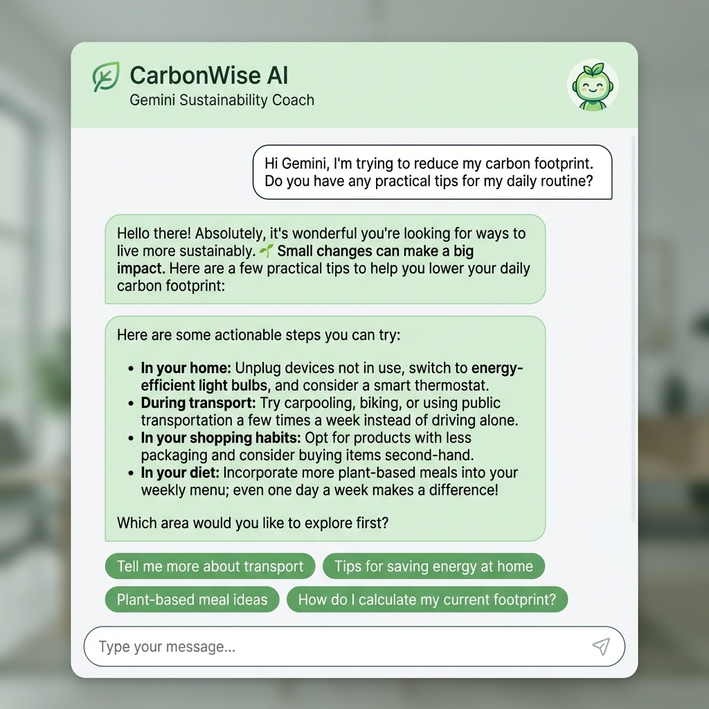

# 🌍 CarbonWise AI

> An AI-powered sustainability platform that helps individuals understand, track, and reduce their carbon footprint through personalized insights and actionable recommendations.

[](https://carbonwise-ai.vercel.app)
[](https://github.com/yashgupta29032006/CarbonWise-AI)
[](https://devpost.com/software/carbonwise-ai-TODO)

---

## 🚀 Quick Start

Get CarbonWise AI running locally in under a minute:

### 1. Clone & Navigate
```bash
git clone https://github.com/yashgupta29032006/CarbonWise-AI.git
cd CarbonWise-AI
```

### 2. Install Dependencies
```bash
npm install
```

### 3. Configure API Key
Create a `.env.local` file in the root directory:
```env
GEMINI_API_KEY=your_api_key_here
```
*(Note: If no API key is specified, the application seamlessly falls back to a local rule-based coaching engine.)*

### 4. Start Development
```bash
npm run dev
```
Open [http://localhost:3000](http://localhost:3000) in your browser.

---

## 🏆 Hackathon Highlights

* 🤖 **Secure Gemini AI Sustainability Coach**: Server-side integration with conversation memory using `gemini-2.5-flash`—completely hidden from client-side bundles.
* 🌍 **Region-Aware Carbon Calculations**: Emission factors calibrate dynamically based on user grids (US, EU, APAC, Global).
* 📊 **Interactive Analytics Dashboard**: Beautiful charting powered by Recharts (pie breakdowns and 6-month area trends).
* 🎯 **Dynamic Challenges**: Weekly challenges automatically adapt to target the user's highest emission category.
* 📅 **Daily Habits & Streaks**: Engaging gamified checklists with daily streak tracking to promote long-term behavior change.
* ♿ **Accessibility First**: Screen-reader friendly semantic HTML, ARIA landmarks, keyboard focus outlines, and WCAG AA contrast.
* 📱 **Polished Responsive Design**: Glassmorphic dark theme tailored for smooth experiences on both desktop and mobile screens.

---

## 💡 Why CarbonWise AI?

Traditional carbon footprint calculators often fail to inspire real action. They present a static, annual emission estimate that feels abstract and detached from daily life. Furthermore, they supply generic recommendations (e.g., "eat less meat" or "drive less") without considering a user's location, household size, occupation, or daily commute styles.

**CarbonWise AI** bridges the gap between awareness and action. We believe personalization is the key to sustainable behavior change. By feeding real calculations directly into a secure Gemini model, the platform constructs an empathetic, context-aware Coach capable of formulating realistic, localized plans. Whether suggesting plant-based recipes for meat-heavy diets or providing a 30-day plan to replace flights with train travel, CarbonWise AI makes climate action simple, daily, and measurable.

---

## ✨ User Journey

```
┌────────────────────────┐      ┌────────────────────────┐      ┌────────────────────────┐
│  1. Complete Onboarding│ ───> │ 2. Log Daily Emissions │ ───> │  3. Analyze Dashboard  │
└────────────────────────┘      └────────────────────────┘      └────────────────────────┘
                                                                             │
                                                                             ▼
┌────────────────────────┐      ┌────────────────────────┐      ┌────────────────────────┐
│6. Complete Challenges &│ <─── │5. Build Streak Habits &│ <─── │ 4. Chat with AI Coach  │
│   Improve Carbon Score │      │   Quantify CO2 Saved   │      │ (Markdown Action Plan) │
└────────────────────────┘      └────────────────────────┘      └────────────────────────┘
```

1. **Complete Onboarding**: Input your region, household, diet, commute, and target reduction level.
2. **Track Daily Emissions**: Log activities across transport, energy, food, waste, and shopping.
3. **Analyze Dashboard**: View carbon score dial, category breakdown, equivalents, and trend progress.
4. **Chat with AI Coach**: Send personalized context to the Gemini Coach to request tailored roadmaps.
5. **Build Streak Habits**: Check off eco habits daily to build streaks and earn achievements.
6. **Improve Carbon Score**: Watch your carbon score scale up towards 100 as annual emissions drop.

---

## 📂 Project Structure

```
CarbonWise-AI/
├── src/
│   ├── app/
│   │   ├── layout.tsx            # Global contexts (Carbon, Theme, Toast) & OnboardingModal
│   │   ├── page.tsx              # Animated Landing Page with stats and features
│   │   ├── dashboard/
│   │   │   └── page.tsx          # Main analytics hub, Recharts, AI chat, habits, badges
│   │   ├── tracker/
│   │   │   └── page.tsx          # Interactive form wizard & equivalents side calculator
│   │   └── api/
│   │       └── chat/
│   │           └── route.ts      # Server POST endpoint with secure Gemini prompt compilation
│   ├── components/
│   │   ├── ui/                   # Shared UI primitives (Button, Toast context)
│   │   ├── Navbar.tsx            # Floating dark mode header
│   │   └── Footer.tsx            # Informational carbon-conscious footer
│   ├── context/
│   │   ├── CarbonContext.tsx     # Central state (submissions, averages, goals, milestones)
│   │   └── ThemeContext.tsx      # Hydration-safe dark mode manager
│   └── utils/
│       ├── carbonCalculations.ts # Mathematical emission coefficients and data quality flags
│       ├── scoreGenerator.ts     # Normalized score curve (0-100) and rating bands
│       ├── aiCoach.ts            # High impact action rules and local chatbot fallback
│       ├── challenges.ts         # Targeted weekly challenges catalog
│       └── regions.ts            # Regional grid carbon intensity metrics
```

---

## 📊 Why This Is Different

| Category | Typical Carbon Calculators | CarbonWise AI |
| :--- | :--- | :--- |
| **Analysis** | Static annual estimates | Real-time calculation side-panel + equivalents |
| **Coaching** | Generic text recommendations | Context-aware Gemini AI Coach with memory |
| **Progress** | One-time computation | Rolling averages, trend tracking, and baseline comparison |
| **Gamification** | None | Daily checklists, streaks, badges, and weekly challenges |
| **Data Quality** | Assumed accurate | Transparency indicators (High, Moderate, Approximation) |
| **Reports** | Raw email result | Downloadable monthly markdown reports |

---

## 🧠 AI in Action

The server-side API handler compiles the user's detailed carbon profile and injects it into a sustainability coach system prompt. Try asking the AI Coach these E2E-tested prompts:

* ❓ **"Explain my carbon score."**
  * *AI Context response*: Explains how the score is calculated relative to the global sustainable target of **3,500 kg CO₂/year** and cites specific high-emission driver categories.
* ❓ **"How can I reduce transportation emissions?"**
  * *AI Context response*: Identifies vehicle kilometers or aviation miles and calculates targeted savings (e.g. replacing flights with trains or car commute with bus).
* ❓ **"Give me a 30-day sustainability plan."**
  * *AI Context response*: Returns a weekly roadmap starting with easy habit adjustments and scaling up to home insulation or vehicle transitions.
* ❓ **"What is my biggest source of emissions?"**
  * *AI Context response*: pinpoints the worst category dynamically based on your calculations.
* ❓ **"Suggest the highest-impact actions for my lifestyle."**
  * *AI Context response*: Recommends the top three behavior changes and estimates annual CO₂ savings.

---

## 💻 Tech Stack

| Layer | Technology | Purpose |
| :--- | :--- | :--- |
| **Frontend Core** | Next.js 15 (App Router) | Optimizes routing, server rendering, and API security |
| **Language** | TypeScript | Ensures compile-time strictness and type safety |
| **Styling** | Tailwind CSS | Speeds up styling with premium responsive dark-mode variables |
| **Animations** | Framer Motion | Drives smooth transitions, onboarding slides, and card fades |
| **Visual Charts** | Recharts | Renders interactive, client-deferred analytics SVGs |
| **AI Processing** | Google Gemini API | Server-only REST interface calling `gemini-2.5-flash` |
| **State Validation** | Zod | Enforces strict schemas on API requests and form submissions |
| **Form Controller** | React Hook Form | Manages granular inputs without re-rendering lag |
| **Testing Frame** | Jest | Unit tests math equations, scores, and mock integrations |

---

## 📐 Carbon Calculation Methodology

Calculations are calibrated against regional averages and EPA/DEFRA benchmarks:

1. **Transportation (Car/Motorcycle/Bus/Metro/Train/Flight)**:
   * Car: `0.180 kg CO₂/km` (Motorcycle: `0.113`, Bus: `0.089`, Train/Metro: `0.041`).
   * Flight: `0.250 kg CO₂/km` (incorporates high-altitude radiative forcing).
2. **Electricity**:
   * Multiplies monthly kWh by regional grids: US (`0.380 kg/kWh`), EU (`0.230 kg/kWh`), APAC (`0.520 kg/kWh`), Global average (`0.420 kg/kWh`).
   * Divided by household size to reflect shared base footprints.
3. **Diet**:
   * Vegan (`1.5`), Vegetarian (`2.0`), Mixed (`4.7`), Meat-Heavy (`7.2`) kg CO₂ equivalent per day.
4. **Waste**:
   * Multiplies baseline occupancy emissions. Recycling reduces footprint by `100 kg/year`. Composting reduces footprint by `100 kg/year`.
5. **Shopping**:
   * Low (`150`), Medium (`450`), High (`900`) kg CO₂ equivalent annually.

> [!NOTE]
> Calculations serve as educational estimates designed to highlight reduction opportunities. They are not intended for corporate compliance auditing.

---

## 🛡️ Privacy & Security

* **Server-Only API Access**: The `GEMINI_API_KEY` is retrieved exclusively on Next.js server runtime (`src/app/api/chat/route.ts`).
* **Zero Client Exposure**: The client never loads `@google/generative-ai` or references API secrets.
* **Payload Validation**: Inputs are validated against strict TypeScript schemas before hitting the REST endpoint.
* **No Database Leak**: MVP stores user profiles strictly in local browser storage, ensuring 100% data ownership.

---

## ⚙️ Engineering Highlights

* **Hydration-Safe Mounting**: Prevents server-side mismatches by deferring SVG charting and local storage updates until client-side mount.
* **Strict TypeScript**: Verified build flags check and eliminate implicit `any` properties and type casting.
* **Clean Code Standards**: No unused imports or variables, matching strict eslint checks.
* **High Coverage**: Jest tests validate score generators, calculations, and route response handling.

---

## 📸 Screen Walkthroughs

### 1. Animated Landing Page

*An animated landing page displaying glassmorphic card grids, responsive navbar controls, and initial onboarding entry points.*

### 2. Analytics Dashboard

*The carbon analytics panel showing Recharts pie breakdown and 6-month reduction trendlines, flanked by Daily Habits trackers.*

### 3. Footprint Calculator Form

*A tabbed wizard displaying transportation commutes alongside the Live equivalents sidebar (gasoline, seedlings equivalents).*

### 4. AI Coach chat

*The Gemini Sustainability chatbot presenting rich markdown advice lists, suggested chips, and a loading typing state.*

---

## 🔮 Future Vision

* **OCR Invoice Parsing**: Scan electricity bills and petrol receipts directly using Gemini Multimodal vision.
* **Smart Meter Sync**: Automate electricity usage logging by sync-connecting local utility APIs.
* **Leaderboards**: Set up local community challenge boards to promote collaborative carbon offsets.
* **Offset Marketplace**: Integrate stripe API endpoints to purchase certified carbon capture offsets.

---

## 🌱 Why It Matters

Individual actions matter. CarbonWise AI makes the invisible carbon footprint visible and provides actionable, personalized roadmaps to make eco-friendly living a daily habit.

---

## 📄 License

This project is licensed under the MIT License. See [LICENSE](LICENSE) for details.
